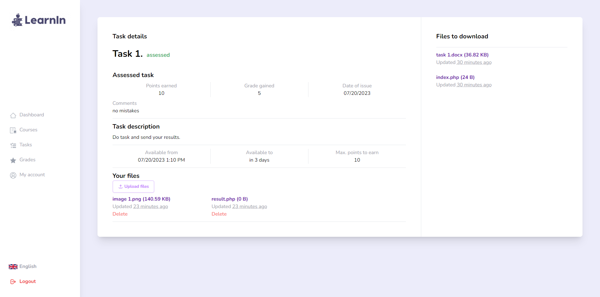
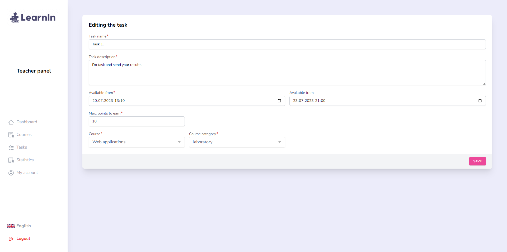
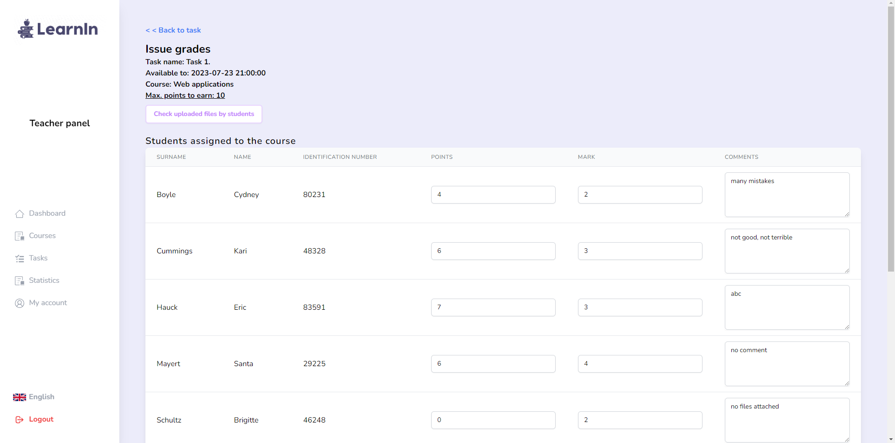
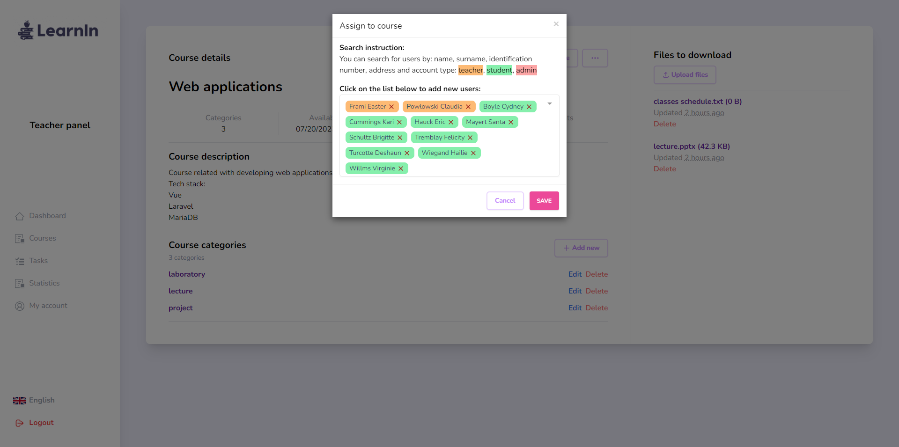
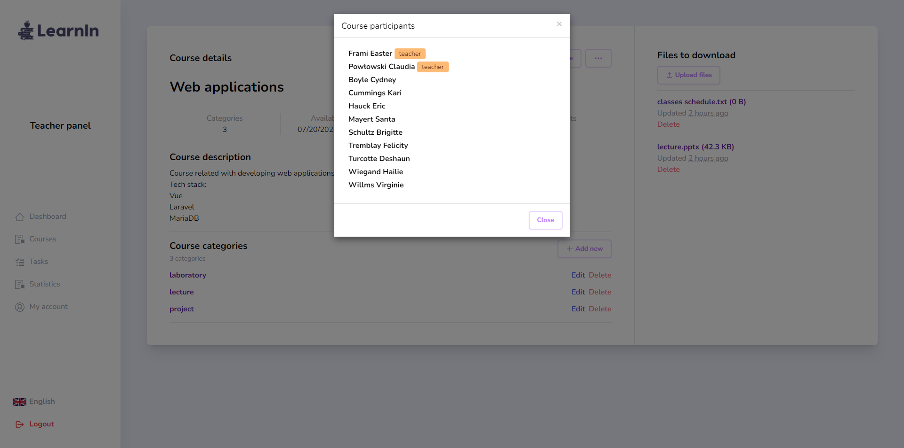
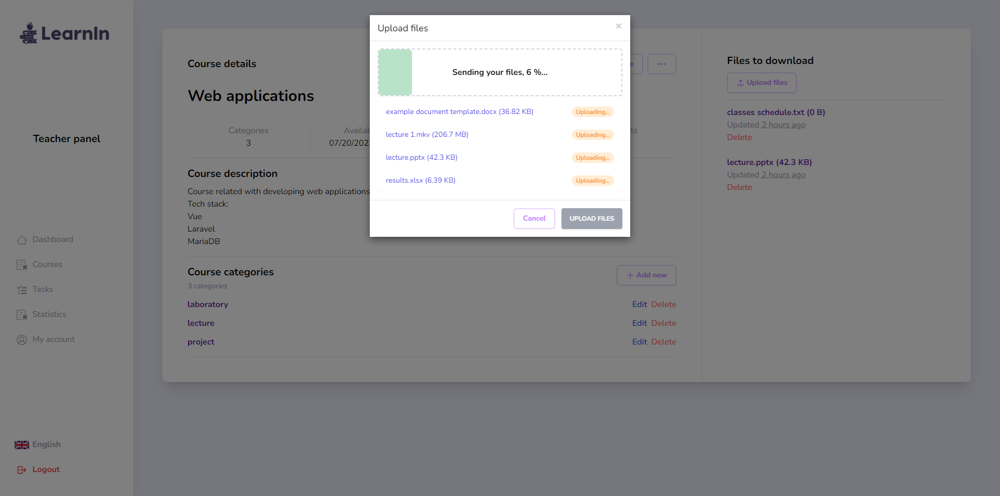
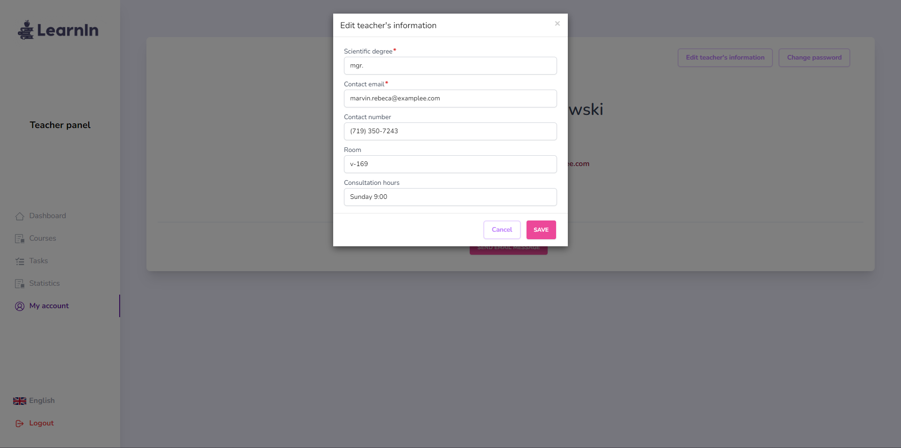

<h1 align="center">
    
</h1>

<p align="center">
    <a href="#features">Features</a>&nbsp;&nbsp; | &nbsp;
    <a href="#screenshots">Screenshots</a>&nbsp; | &nbsp;    
    <a href="#getting-started">Getting started</a>&nbsp; | &nbsp;
    <a href="#configuration">Configuration</a>&nbsp; | &nbsp;
    <a href="#used-technologies-and-tools">Technologies and tools</a>&nbsp; | &nbsp;
    <a href="#license">License</a>
</p>

# About

LearnIn is the next generation learning management system. Provides constant monitoring of students in the progress of teaching. Create courses and tasks, issue grades for students, check uploaded files by students, add course and task referential files, generate statistics, and more.

<div align="center">
    
    LearnIn dashboard
</div>

# Features

-   provides three types of user: administrator, teacher and student
-   create courses and assign users them
-   create categories to the course
-   create tasks related with course categories
-   issue grades for students
-   easily assign new users to the course
-   watch uploaded files by students and download .zip with all files
-   upload course files (ex. lectures, books, etc.), task referential files (ex. instructions, executable programs, etc.) and student file to the task
-   administration panel for managing all courses, users and tasks
-   generate students marks statistics from specific task or whole course category
-   user-friendly, responsive layout
-   multilingual support (available now: English and Polish)

# Screenshots













# Getting started

### Production environment

1. Copy .env.example file to .env.

```
cp .env.example .env
```

2. In project directory run docker compose command:

```
docker-compose -f .\docker-compose.yml up -d --build
```

3. Seed database with admin account:

```
docker exec -it app sh -c "php /var/www/html/artisan db:seed"
```

4. To stop project just type command:

```
docker-compose -f .\docker-compose.yml down
```

5. App is on address `http://localhost:80/`
6. **The default admin account credentials:**

-   email: `email@email.com`
-   password: `Admin#12345`
7. **Other users credentials:**

   |          | email                   | passwords  | example            |
   |----------|-------------------------|------------|--------------------|
   | students | student[1-15]@email.com | User#12345 | student5@email.com |
   | teachers | teacher[1-5]@email.com  | User#12345 | teacher1@email.com |

If you don't want these accounts, remove in administration panel.

# Configuration

You can configure the project by your own needs.
To do this, open .env file (cloned from .env.example).

1. Change database connection information.

```dotenv
DB_CONNECTION=mysql
DB_HOST=mariadb
DB_PORT=3306
DB_DATABASE=learnin
DB_USERNAME=root
DB_PASSWORD=examplepassword
```

2. It's highly recommend to run the scheduler (that cleans old generated .zip files by teachers every 12 hours):

**In Docker:**
```
docker exec -it app sh -c "php /var/www/html/artisan schedule:work"
```

**Locally:**
```
php artisan schedule:work
```

2. Optional: Change default locale and timezone.

```dotenv
LOCALE_TIMEZONE=UTC
LOCALE_DEFAULT=en
LOCALE_FAKER=en
```
3. Optional: Change API SERVER URL:
```dotenv
API_URL=http://localhost:8000/api
```

# Used technologies and tools

-   HTML5
-   PHP Laravel Framework v10.15.0
-   MariaDB
-   Apache
-   Tailwind CSS v3.3.3
-   Vue 3 and libraries:
    -   Vuex
    -   Axios
    -   Lodash
    -   laravel-vue-i18n
    -   vue-router
    -   DayJS
    -   vue-multiselect
    -   vue-toastification
    -   vue3-popper
    -   vuejs-paginate-next
    -   vue-modal
-   Docker and Docker Compose
-   bundler: Vite
-   IDE and tools: Jetbrains PHPStorm, Postman, Jetbrains DataGrip

# License

Distributed under the MIT License.
