<h1 align="center">
    
</h1>

<p align="center">
    <a href="#features">Features</a>&nbsp;&nbsp; | &nbsp;
    <a href="#getting-started">Getting started</a>&nbsp; | &nbsp;
    <a href="#configuration">Configuration</a>&nbsp; | &nbsp;
    <a href="#used-technologies-and-tools">Technologies and tools</a>&nbsp; | &nbsp; 
    <a href="#screenshots">Screenshots</a>&nbsp; | &nbsp;
    <a href="#license">License</a>
</p>

# About
LearnIn is the next generation learning management system. Provides constant monitoring of students in the progress of teaching. Create courses and tasks, issue grades for students, check uploaded files by students, add course and task referential files, prepare statistics, and more.

<div align="center">
    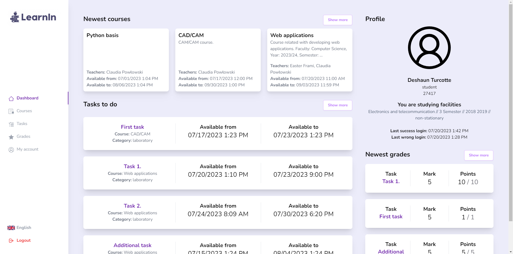
    LearnIn dashboard
</div>

# Features
- provides three types of user: administrator, teacher and student
- create courses and assign users them
- create categories to the course
- create tasks related with course categories
- issue grades for students
- easily assign new users to the course
- watch uploaded files by students and download .zip with all files
- upload course files (ex. lectures, books, etc.), task referential files (ex. instructions, executable programs, etc.) and student file to the task
- administration panel for managing all courses, users and tasks
- generate students marks statistics from specific task or whole course category
- user-friendly, responsive layout
- multilingual support (available now: English and Polish)

# Getting started
### Production environment
1. Copy .env.example file to .env.
```
cp .env.example .env
````
2. In project directory run docker compose command:
```
docker-compose -f .\docker-compose.yml up -d
```
3. Seed database with admin account:
```
docker exec -it app sh -c "php /var/www/html/artisan db:seed"
```
4. To stop project just type command:
```
docker-compose -f .\docker-compose.yml down
```
5. App is on address `http://localhost:80/`
6. **The default admin account credentials:** 
- email: `email@email.com`
- password: `Admin#12345`

### Development environment
1. Copy .env.example file to .env.
```
cp .env.example .env
```
2. In project directory run docker compose command:
```
docker-compose -f .\docker-compose.dev.yml up -d
```
3. Generate app key and jwt secret
```
docker exec -it app sh -c "php /var/www/html/artisan migrate && php /var/www/html/artisan key:generate && echo 'yes' | php /var/www/html/artisan jwt:secret"
```
4. Seed database with default admin account.
```
docker exec -it app sh -c "php /var/www/html/artisan db:seed"
```
5. To stop project just type command:
```
docker-compose -f .\docker-compose.dev.yml down
```
6. App is on address `http://localhost:80/`
7. **The default admin account credentials:**
- email: `email@email.com`
- password: `Admin#12345`

# Configuration
You can configure the project by your own needs.
To do this, open .env file (cloned from .env.example).

1. Change database connection information.
```dotenv
DB_CONNECTION=mysql
DB_HOST=mariadb
DB_PORT=3306
DB_DATABASE=learnin
DB_USERNAME=root
DB_PASSWORD=examplepassword
```
2. Optional: Change default locale and timezone.
```dotenv
TIMEZONE=Europe/Warsaw
DEFAULT_LOCALE=en
DEFAULT_FALLBACK_LOCALE=en
FAKER_LOCALE=en
```
and change it also /resources/js/main.js file
```javascript
use(i18nVue, {
       lang: 'en',
       resolve: lang => require(`../../lang/${lang}.json`),
})
```

# Used technologies and tools
- HTML5
- PHP Laravel Framework v9.8.1
- MariaDB
- Apache
- Tailwind CSS v3.1.8
- Vue 3 and libraries:
    - Vuex
    - Axios
    - Lodash
    - laravel-vue-i18n
    - vue-router
    - DayJS
    - vue-multiselect
    - vue-toastification
    - vue3-popper
    - vuejs-paginate-next
    - vue-modal
- Docker and Docker Compose
- bundler: laravel-mix (webpack)
- IDE and tools: Jetbrains PHPStorm, Postman, Jetbrains DataGrip

# Screenshots
<details>
    <summary>Click to show</summary>
    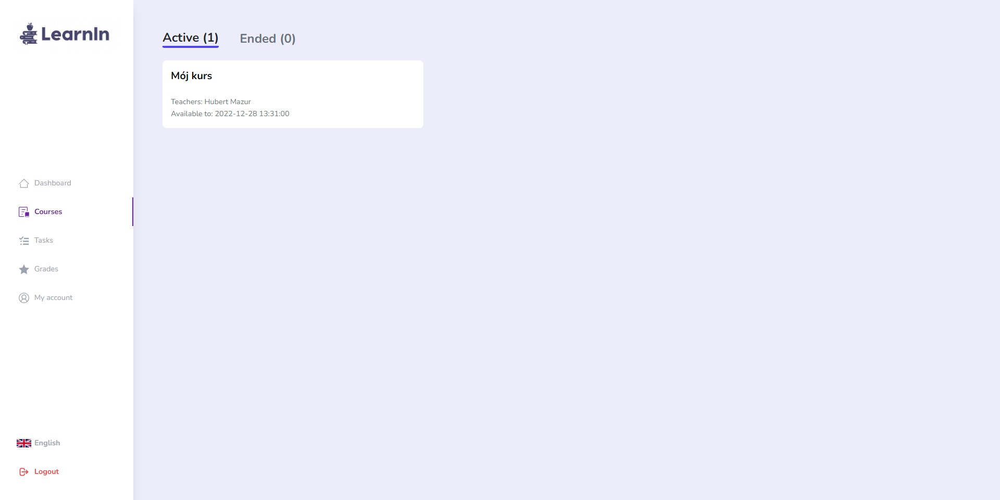
    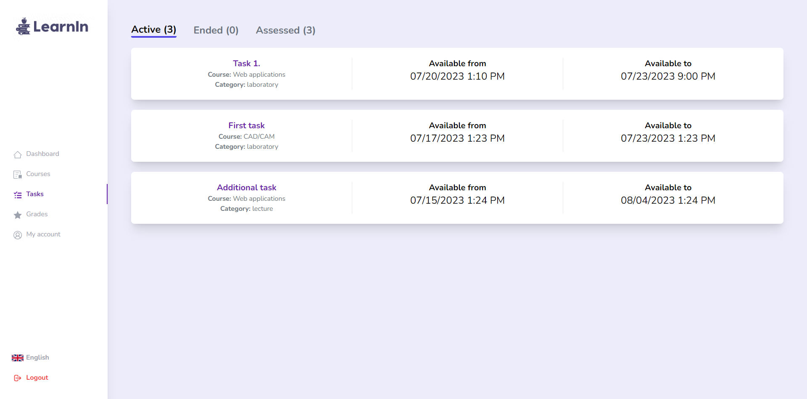
    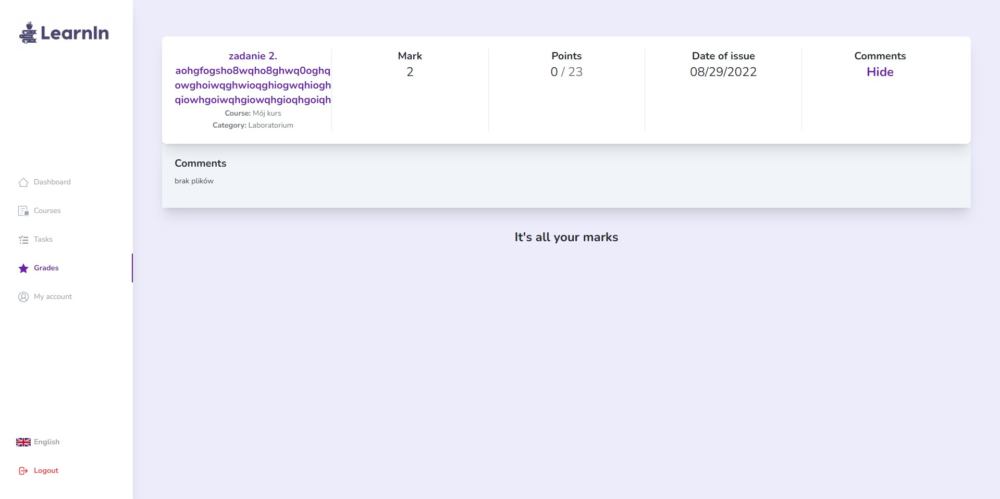
    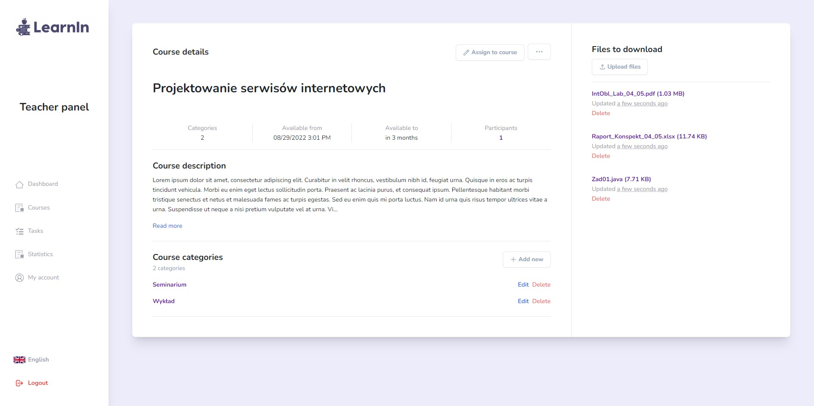
    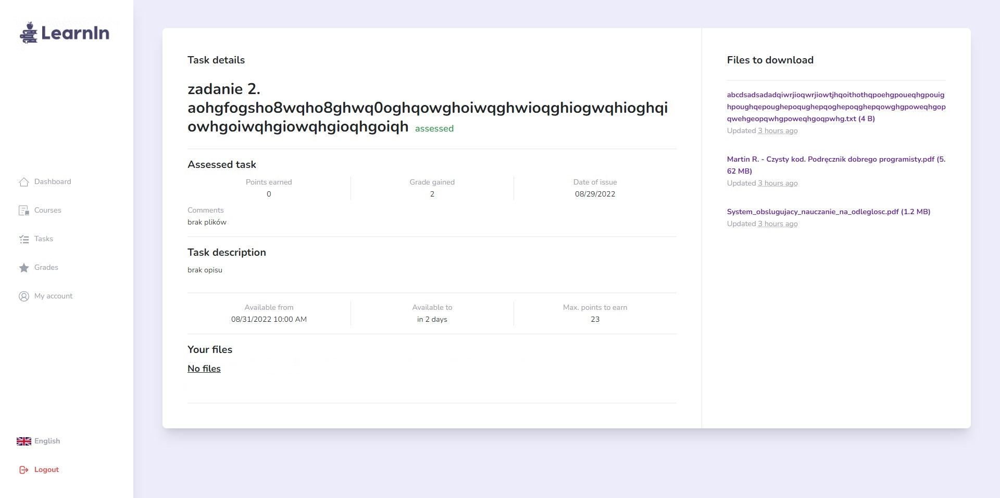
    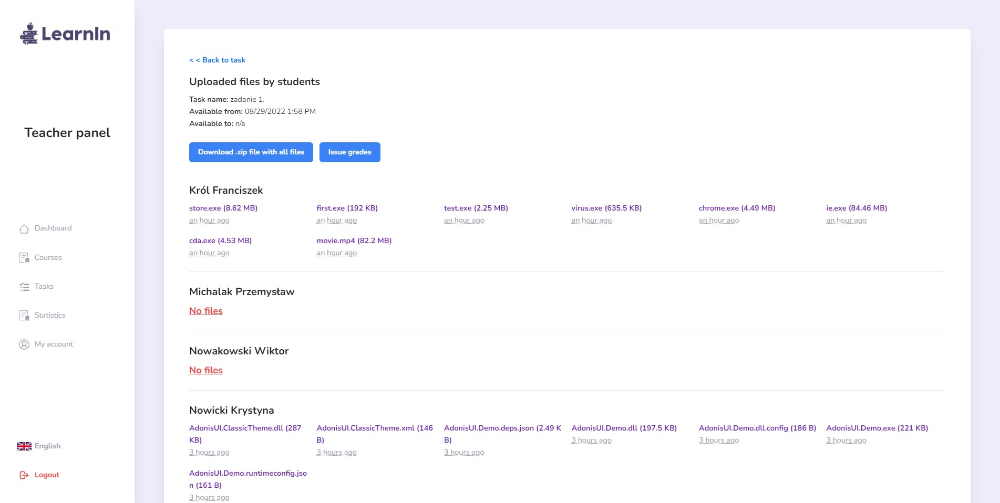
    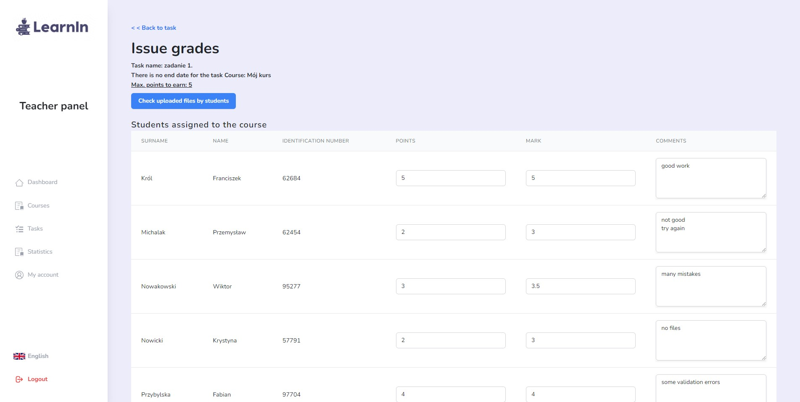
    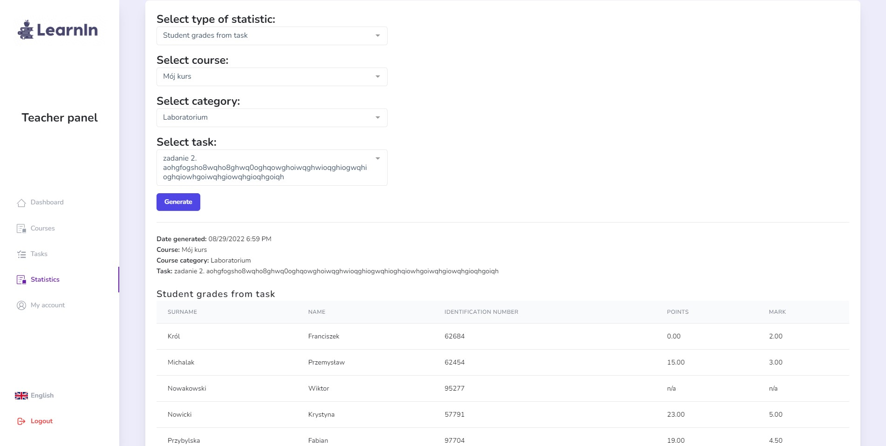
    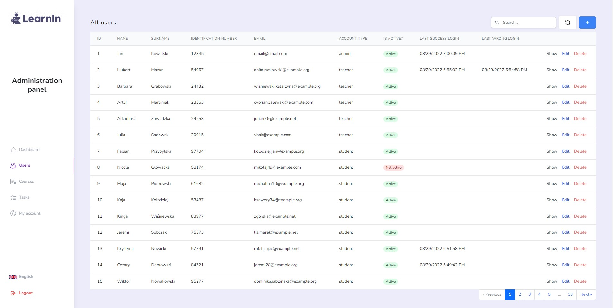
    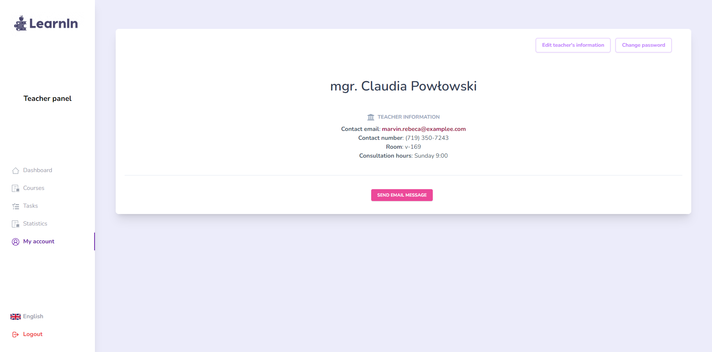
</details>

# License
Distributed under the MIT License.
